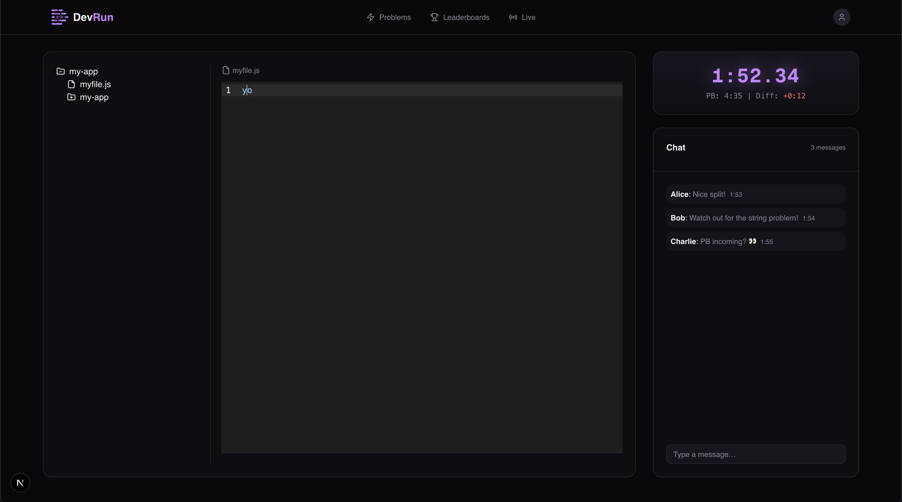

<h1 align="center">
  <br>
  <a href="https://dev-run.netlify.app/">
    
  </a>
  <br>
  DevRun
  <br>
</h1>

<h4 align="center">
  A community-driven competitive programming platform inspired by speedrunning.
  <br>
  Start a run, reset, improve your PB, and compete for the fastest times.
</h4>

<p align="center">
  <a href="#key-features">Key Features</a> •
  <a href="#contributing">Contributing</a> •
  <a href="#license">License</a>
</p>



## Key Features

### Runs & Speedrunning Mechanics

- **Run-Based Gameplay** — Problems are played as _runs_, not isolated challenges. Start a run, solve problems in sequence, and race the clock.
- **Splits & PBs** — Track per-problem splits and your personal bests, just like speedrunning.
- **Reset & Retry** — Reset runs at any time and try again to beat your previous time.

### Problems & Categories

- **Curated Problem Sets** — Problems are grouped into runs with varying difficulty and themes.
- **Categories** — Compete in different categories such as Any%, No-Hints, or Practice.
- **No Interview Pressure** — DevRun is built for fun, learning, and improvement, not job prep.

### Leaderboards & Community

- **Global & Weekly Leaderboards** — Compare runs with other DevRunners around the world.
- **Runner Profiles** — View stats like total runs, PBs, and recent attempts.
- **Community-First Design** — Competitive, but casual. Built for hobbyists.

### UI & Experience

- **Minimal, Dark UI** — Black theme with subtle purple highlights, designed for focus.
- **Fast & Responsive** — Lightweight interface with subtle motion and feedback.
- **Speedrunning Language** — Runs, PBs, resets, clean runs, the culture comes first.

### Planned Features

- Custom runs and community-created problem sets
- Seasonal events and themed runs
- More categories and run modifiers

## Contributing

DevRun is a community-driven project, and contributions of all kinds are welcome — code, design, ideas, and feedback.

### Ways to Contribute

- **UI / UX improvements** — layout tweaks, animations, accessibility, theming
- **Problem & run ideas** — suggest fun challenges or speedrun-style categories
- **Bug reports** — even visual or copy issues help a lot
- **Docs & copy** — improve wording, onboarding, or community tone

### Guidelines

- Keep things **simple and playful** — DevRun is not an interview platform.
- Prioritize **clarity, performance, and readability** over cleverness.
- Avoid over-engineering; this project values iteration and experimentation.
- Be respectful and constructive — competition stays in the runs, not the PRs.

### Getting Started

1. Fork the repository
2. Create a feature branch
3. Make your changes
4. Open a pull request with a clear description of what you changed and why

---

By contributing, you agree to follow the project’s Code of Conduct.

```bash
git clone https://github.com/orus-dev/devrun.git
cd devrun
npm install
npm run dev
```
